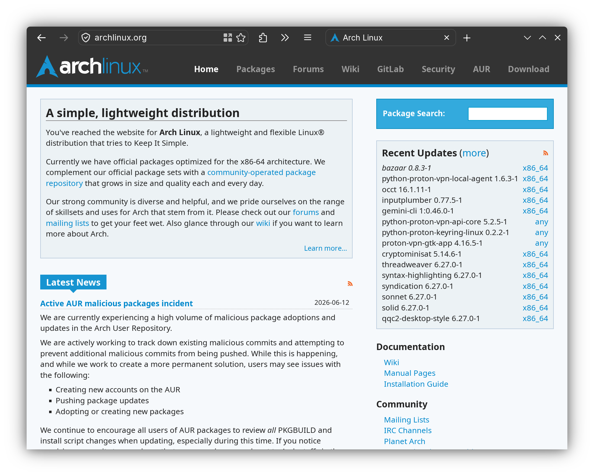
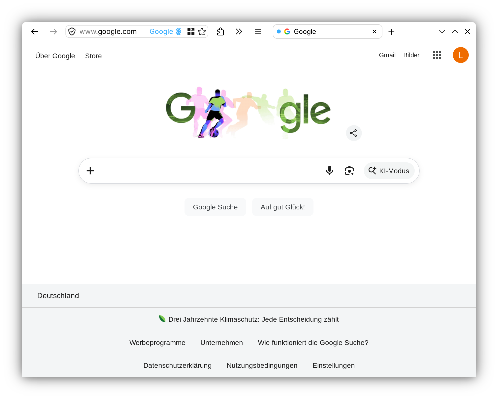

# Firefox-Single-Row-Layout

> A `userChrome.css` tweak that puts the **address bar and the tabs on a single row**, for a slimmer, more minimal Firefox.

The address bar sits on the left and the tabs fill the rest of the row. It can optionally grow when focused so long URLs have more room (off by default, see Customization). Pairs nicely with a dynamic toolbar color and with Multi-Account Containers.

---

## Screenshots

### Adaptive color on different sites
With the recommended *Adaptive Tab Bar Colour* extension, the single strip takes on the color of the current page.

| | |
|---|---|
|  |  |

### Multi-Account Containers
Container tabs show a small colored dot in front of the favicon instead of the default colored stripe.

---

## Features

- Address bar and tabs share one row, saves roughly a toolbar's worth of vertical space.
- The address bar fills the available toolbar width. It can **optionally** expand further when focused, disabled by default; enable it by setting `--uc-navbar-width-focused` larger than `--uc-navbar-width`. Focus the address bar with `Ctrl+L` (or `F6`).
- **Density-independent**: works with Firefox's compact, normal, and touch densities without manual pixel tweaking.
- **Window-state stable**: the gap between the last button and the first tab stays constant whether the window is maximized or freely resized.
- Shadows removed for a seamless strip; smooth color transitions.
- **Multi-Account Containers**: the container indicator becomes a colored dot before the favicon.
- Designed to look right together with **Adaptive Tab Bar Colour** (dynamic per-site coloring).

---

## Requirements

- Firefox desktop. Developed and tested on **Firefox 151** (Linux). It relies on modern selectors (`:has()`) and current internal class names, so very old Firefox versions will not work and future major versions may need small selector updates.

---

## Installation

### 1. Enable custom stylesheets

1. Open `about:config` in the address bar and accept the warning.
2. Search for `toolkit.legacyUserProfileCustomizations.stylesheets`.
3. Double-click it so it is set to **true**.

### 2. Open your profile's `chrome` folder

1. Open `about:profiles` (or `about:support`).
2. Find your active profile and click **Open Folder** / **Open Directory** under *Root Directory*.
3. Inside that folder, create a folder named exactly `chrome` if it does not already exist.

### 3. Add the stylesheet

- Copy [`userChrome.css`](userChrome.css) into that `chrome` folder.
- If a `userChrome.css` already exists, append the contents instead of overwriting.

### 4. Restart Firefox

Fully quit and reopen Firefox. The layout should now be active.

---

## Recommended: Adaptive Tab Bar Colour

This layout is built to blend with a single, uniform strip color. The
[**Adaptive Tab Bar Colour**](https://addons.mozilla.org/firefox/addon/adaptive-tab-bar-colour/)
extension dynamically tints the toolbar to match the page you are on, which makes the merged row look intentional rather than two-toned.

The nav-bar background is set to `transparent` in this stylesheet on purpose, so the color the extension sets shines through across the whole strip.

### Importing the included settings

A settings export, [`atbc_pref.json`](atbc_pref.json), is included so you can reproduce the configuration used in the screenshots:

1. Open the Adaptive Tab Bar Colour options (Add-ons Manager → the extension → **Preferences/Options**).
2. Use its **Import** function and select `atbc_pref.json`.

> Note: the effect is subtle on near-white pages (the color is taken from the page), and clearly visible on sites with a strong brand color.

---

## Multi-Account Containers

Works with [Firefox Multi-Account Containers](https://addons.mozilla.org/firefox/addon/multi-account-containers/).
Instead of Firefox's default colored stripe on container tabs, this stylesheet hides the stripe and draws a small **dot in the container's color before the favicon**. The dot color is read from Firefox's own container variable, so it matches whatever color you assigned to each container.

---

## Customization

All the dials live in the `:root` block at the top of `userChrome.css`:

| Variable | Default | What it does |
|---|---|---|
| `--uc-navbar-width` | `500px` | Width of the left toolbar area = where the tab strip begins. Larger ⇒ more room for the address bar/buttons, fewer for tabs. |
| `--uc-navbar-width-focused` | `500px` | Same, but while the address bar is focused. Set it larger to let the URL bar expand on focus. |
| `--uc-navbar-gap` | `12px` | Gap between the last button (hamburger) and the first tab. |
| `--uc-btn-gap` | `3px` | Spacing between individual toolbar buttons. |
| `--uc-line-height` | `calc(...)` | Row height, derived from Firefox's density variable. Adjust **only** if a particular density looks slightly misaligned. |

The dot size (`8px`) and its gap to the favicon (`5px`) can be changed in the last rule of the file.

---

## Troubleshooting

- **Something misaligns after a Firefox update.** Major versions occasionally rename internal elements. Use the Browser Toolbox (`Ctrl+Alt+Shift+I`, after enabling browser/add-on debugging in the developer tools settings) to inspect the affected element and update the selector.
- **A density looks a few pixels off.** Tweak `--uc-line-height` only.
- **The container dot has no color / the stripe is still there.** Inspect a container tab in the Browser Toolbox to confirm the current class name and `--identity-*` variable, then adjust the last two rules.

---

## Credits

- **Base layout:** [va9iff/firefox-single-row-layout](https://github.com/va9iff/firefox-single-row-layout), the original idea and the core technique (raise the URL bar into the tab row, reserve left padding on the tab strip, grow on focus). Used and republished **with the author's kind permission** ([see comment](https://github.com/va9iff/firefox-single-row-layout/issues/3#issuecomment-4699071580)).
- **Rework:** the stylesheet was substantially revised **with the help of an AI assistant (Claude by Anthropic)**, density-independent height, synchronized focus state, unified button spacing, shadow cleanup, window-state-stable spacing, and the container-dot treatment.
- **Recommended extension:** [Adaptive Tab Bar Colour](https://addons.mozilla.org/firefox/addon/adaptive-tab-bar-colour/) by easonwong.

---

## License

The original project [va9iff/firefox-single-row-layout](https://github.com/va9iff/firefox-single-row-layout) has no license file, which under default copyright means its rights are reserved by its author. It is used and republished here **with the author's explicit permission** ([see comment](https://github.com/va9iff/firefox-single-row-layout/issues/3#issuecomment-4699071580)), that permission covers this project specifically and is not a general license of the upstream code.

The modifications in this repository are released under the [MIT License](LICENSE). The MIT terms apply to **this project's own changes**; the upstream base remains under its author's rights as noted above.
